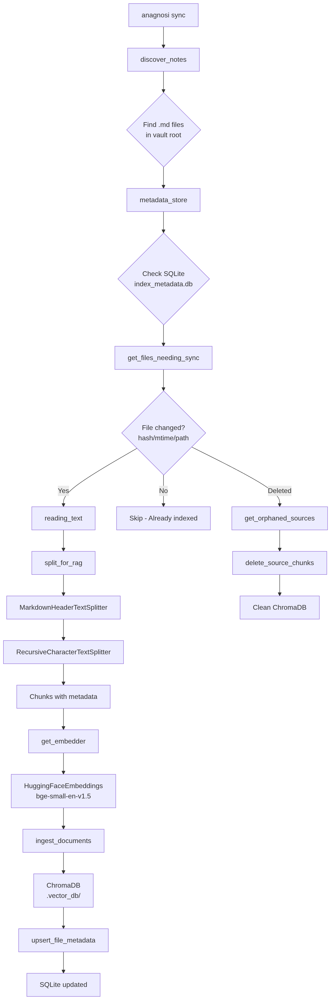
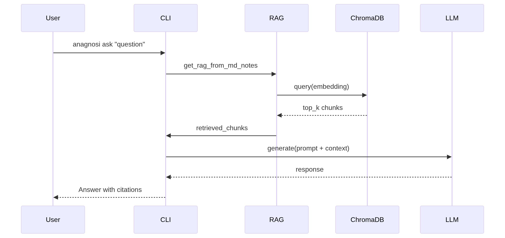

# Anagnosi - Personal knowledge base
[](https://www.python.org/downloads/)
[](https://docs.astral.sh/uv/)
[](https://github.com/Pavloffm/Anagnosi/actions/workflows/ci.yml)
[](https://opensource.org/licenses/MIT)

> **Anagnosi** is a privacy-first, local-first Personal Knowledge Base powered by Retrieval-Augmented Generation (RAG). It lets you ask questions about your Markdown notes and get AI-powered answers without sending your data to the cloud.
## Features
- **Privacy First**: All indexing and inference happen locally or on your private server. No data leaves your control.
- **RAG-Powered**: Retrieves relevant context from your notes before generating answers.
- **Incremental Sync**: Only re-indexes changed files using SQLite metadata tracking.
- **Dual LLM Support**
  - **Ollama**: Connect to local or remote Ollama instances (Recommended).
  - **Transformers**: Built-in support for local Hugging Face models (No external server needed).
- **Markdown Native**: Works directly with your existing `.md` files.

## Prerequisites
- Python 3.12+
- [uv](https://docs.astral.sh/uv/getting-started/installation/) for dependency management
- [Ollama](https://ollama.com/download) Required for `anagnosti ask`
## Installation
### 1: Clone the Repository
```commandline
git clone https://github.com/Pavloffm/Anagnosi.git
cd Anagnosi
```
### 2: Install Dependencies
```commandline
uv sync
source .venv/bin/activate  # On Linux/macOS. For Windows: .venv\Scripts\activate
```

### 3: Configure Environment
```bash
# Copy the example environment file
cp .env.example .env

# Edit with your preferences
nano .env  # or use your preferred editor
```

### 4.  Initialize Project Structure
```bash
anagnosi init
```
This creates the following directory structure in your vault:
```
anagnosi_vault/
├── 0000_home/
│   └── 0000_home.md
├── 0001_inbox/
├── 0002_calendar/
│   ├── 0000_daily/
│   ├── 0001_weekly/
│   ├── 0002_monthly/
│   ├── 0003_quarterly/
│   └── 0004_yearly/
├── 0003_sources/
├── 0004_templates/
│   └── people-template.md
├── 0005_attachments/
├── 0006_peoples/
└── 9999_archive/
```
> **Important Note on Indexing**
>
> Currently, Anagnosi indexes **only `.md` files located in the root** of your vault directory (`anagnosi_vault/*.md`). 
> 
> Files inside subfolders (like `0000_home/`) are organized for you but **will not be indexed** by the RAG system unless moved to the root.
## Configuration
| Variable                     | Default                                 | Description                            |
|------------------------------|-----------------------------------------|----------------------------------------|
| `APP_ROOT_PATH`              | Current directory                       | Base path for the application          |
| `HF_TOKEN`                   | `"hf_xxxxxxxxxxxxxxxxxxxxxxxxxxxxxxxx"` | Hugging Face token for model downloads |
| `DEBUG_MODE`                 | `false`                                 | Enable debug logging                   |
| `EMBEDDING_MODEL_NAME`       | `BAAI/bge-small-en-v1.5`                | Embedding model for RAG                |
| `RAG_EMBEDDING_BATCH_SIZE`   | `32`                                    | Batch size for embeddings              |
| `RAG_CHUNK_SIZE`             | `256`                                   | Text chunk size for indexing           |
| `RAG_CHUNK_OVERLAP`          | `32`                                    | Overlap between chunks                 |
| `OLLAMA_BASE_URL`            | `http://localhost:11434`                | Ollama server URL                      |
| `OLLAMA_DEFAULT_MODEL`       | `qwen3.5:4b`                            | Default LLM model                      |
| `OLLAMA_DEFAULT_TIMEOUT`     | `120`                                   | Request timeout in seconds             |
| `OLLAMA_DEFAULT_TEMPERATURE` | `0.1`                                   | LLM temperature                        |
| `OLLAMA_DEFAULT_NUM_CTX`     | `4096`                                  | Context window size                    |
## Using a Remote Ollama Server (Optional)
By default, Anagnosi expects Ollama to run locally at http://localhost:11434. However, you can deploy Ollama on a separate machine (e.g., a GPU server, NAS, or Raspberry Pi) and connect Anagnosi to it remotely. If you prefer **not to use Ollama at all**, Anagnosi includes a built-in local LLM option using Hugging Face Transformers:
### Option 1: Quick Setup with [remote-llm-server](https://github.com/Pavloffm/remote-llm-server)
#### 1. Deploy the Remote Server
```bash
# On your server machine (with Docker + optional NVIDIA GPU)
git clone https://github.com/Pavloffm/remote-llm-server.git
cd remote-llm-server
docker compose up --build -d
```
#### 2. Pull Models Inside the Container
```bash
# Enter the container
docker exec -it ollama bash

# Pull your preferred models
ollama pull qwen3.5:4b
ollama pull qwen3.5:9b-q4_K_M

# Verify
ollama list
exit
```
#### 3. Configure Anagnosi to Connect Remotely
On your client machine where Anagnosi runs, edit .env:
```bash
# Replace with your server's LAN IP (e.g., 192.168.1.100)
OLLAMA_BASE_URL=http://192.168.1.100:11434
OLLAMA_DEFAULT_MODEL=qwen3.5:4b
```
> Security Tip: Only expose Ollama on your local network. For remote access beyond LAN, place the server behind a reverse proxy (Nginx/Caddy) with authentication.
#### 4. Test the Connection
```bash
# From your client machine
curl http://192.168.1.100:11434/api/tags

# Then use Anagnosi normally
anagnosi ask "What notes do I have about Docker?"
``` 
### Option 2: Manual Ollama Installation on Remote Host
If you prefer to install Ollama directly:
1. Install Ollama on your server: https://ollama.com/download
2. Start Ollama bound to all interfaces: ```bash
```bash
OLLAMA_HOST=0.0.0.0 ollama serve 
```
3. Pull models: `ollama pull qwen3.5:4b`
4. Configure Anagnosi's `.env `with your server's IP as shown above.

> **Port Configuration Note**
> 
> The default Ollama port is **`11434`**. If you're running Ollama in a non-standard setup, update `OLLAMA_BASE_URL` in your `.env` accordingly:
> 
> | Setup Scenario                           | Default Port  | How to Verify/Change                                                  | Example `.env`                   |
> |------------------------------------------|---------------|-----------------------------------------------------------------------|----------------------------------|
> | **Docker** (remote-llm-server)           | `11434`       | Check `docker-compose.yml` ports mapping                              | `http://192.168.1.100:11434`     |
> | **Native install** (Linux/macOS/Windows) | `11434`       | Run `ollama serve --help` or check process: `ps aux \| grep ollama`   | `http://localhost:11434`         |
> | **Custom port** (any setup)              | *Your choice* | Set env var before starting: `OLLAMA_HOST=0.0.0.0:8080 ollama serve`  | `http://localhost:8080`          |
> | **Behind reverse proxy**                 | *Proxy port*  | Check your Nginx/Caddy config for `proxy_pass` or `handle` directives | `https://your-domain.com/ollama` |
> 
> **Quick test**: Verify your Ollama endpoint is reachable:
> ```bash
> curl http://<your-host>:<your-port>/api/tags
> ```
> If you get a JSON response with `"models"`, your port configuration is correct!
>
> **Option 3 has the same problem with the port!**

### Option 3: Use Local Ollama (Default)
If you want to keep everything on one machine:
```bash
# Install Ollama locally
curl -fsSL https://ollama.com/install.sh | sh

# Pull a model
ollama pull qwen3.5:4b

# Anagnosi will auto-connect to http://localhost:11434 
anagnosi sync
anagnosi ask "What projects am I working on?" 
```
## Usage
### Command Overview
| Command              | Description                                  |
|----------------------|----------------------------------------------|
| `anagnosi init`      | Initialize project structure                 |
| `anagnosi sync`      | Index Markdown files to vector database      |
| `anagnosi ask`       | Ask questions using Ollama LLM               |
| `anagnosi ask-local` | Ask questions using local Transformers model |
### 1. Initialize the Vault
```bash
anagnosi init
```
### 2. Add Your Notes
Place your Markdown files (`.md`) in the root of your vault directory. The system will discover and index them [after syncing documents](#3-sync-documents).
### 3. Sync Documents
```bash
# Normal sync
anagnosi sync

# Force re-index all files
anagnosi sync --force
```
### 4. Ask Questions
#### Using Ollama 
```bash
# Basic query
anagnosi ask "What projects am I working on?"

# With custom parameters
anagnosi ask "Summarize my meeting notes" --top-k 10 --no-stream
```
#### Using Local Transformers Model
```bash
# Default model
anagnosi ask-local "What is docker?"

# Custom model and device
anagnosi ask-local "Explain RAG" --model "HuggingFaceTB/SmolLM2-135M-Instruct" --device "cuda"
```

## Development
### Run Tests

```bash
# All tests
uv run pytest

# With coverage
uv run pytest --cov=anagnosi --cov-report=html

# Specific test file
uv run pytest tests/unit/test_rag.py -v
```
### Code Quality
```bash
# Lint with Ruff
uv run ruff check src/ tests/

# Auto-fix issues
uv run ruff check --fix src/ tests/

# Pre-commit hooks
pre-commit install
pre-commit run --all-files
```
### Debug Mode
Enable verbose logging:
```bash
# In .env
DEBUG_MODE=true

# Or set environment variable
export DEBUG_MODE=true
```
## Architecture
### Indexing Flow
<p align="center">
  
</p>

### Query Flow
<p align="center">
  
</p>

## Acknowledgments
- [LangChain](https://langchain.com/) - RAG framework
- [ChromaDB](https://www.trychroma.com/) - Vector database
- [Ollama](https://ollama.com/) - Local LLM serving
- [Hugging Face](https://huggingface.co/) - Models and embeddings
- [Typer](https://typer.tiangolo.com/) - CLI framework